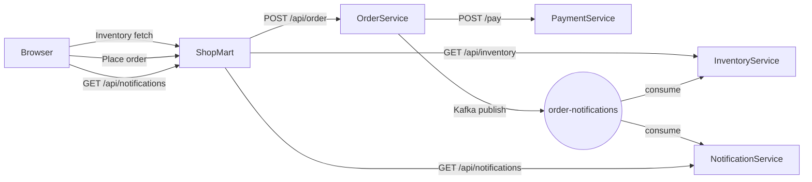

# ShopMart Microservices Architecture

## Overview

This repository implements a small e-commerce microservices system named **ShopMart**. It uses separate services for inventory, order processing, payment, notifications, and a lightweight frontend/proxy app.

## Components

### 1. ShopMart (Frontend + API Proxy)
- Location: `ShopMart/`
- Purpose: serve a static shopping cart UI and proxy browser requests to backend services.
- Exposes:
  - `GET /api/inventory` → InventoryService
  - `POST /api/order` → OrderService
  - `GET /api/notifications` → NotificationService
- Uses HTTP clients to call backend services through Docker service names.
- Serves `wwwroot/index.html` and static assets.

### 2. InventoryService
- Location: `InventoryService/`
- Purpose: manage product data, stock reservation, and inventory confirmation/cancellation.
- Exposes API:
  - `GET /api/inventory/products`
  - `GET /api/inventory/products/{productId}`
  - `POST /api/inventory/check`
  - `POST /api/inventory/reserve`
  - `POST /api/inventory/confirm/{orderId}`
  - `POST /api/inventory/cancel/{orderId}`
  - `PUT /api/inventory/update-stock`
- Uses a background Kafka consumer to listen for order notifications and automatically confirm or cancel stock reservations.

### 3. OrderService
- Location: `OrderService/`
- Purpose: receive customer orders, process payment, and publish notifications.
- Exposes API:
  - `POST /api/orders`
  - `GET /api/orders/{orderId}`
- Workflow:
  1. Validates order payload.
  2. Sets `order.Status = PaymentProcessing`.
  3. Calls PaymentService `/pay`.
  4. Publishes a notification message to Kafka topic `order-notifications`.
  5. Returns success or failure to ShopMart.

### 4. PaymentService
- Location: `PaymentService/`
- Purpose: simulate payment processing.
- Exposes API:
  - `POST /pay`
- Behavior: randomly simulates payment success or failure and returns a `PaymentResponse`.

### 5. NotificationService
- Location: `NotificationService/`
- Purpose: consume Kafka notifications, log/send notifications, and expose history.
- Exposes API:
  - `GET /api/notifications`
- Uses a background hosted Kafka consumer and `INotificationStore` to keep recent notification history in memory.

### 6. Kafka / Zookeeper
- Managed through Docker Compose.
- Topics:
  - `order-notifications`
- Used for decoupled notification delivery from OrderService to NotificationService and InventoryService.

## Data Flow



1. A customer browses ShopMart.
2. ShopMart loads inventory from `InventoryService`.
3. When the user places an order, ShopMart forwards the request to `OrderService`.
4. `OrderService` calls `PaymentService` to execute payment.
5. `OrderService` publishes an order notification to Kafka.
6. `NotificationService` consumes the notification and logs or stores it.
7. `InventoryService` also consumes the notification to confirm or cancel reservations.
8. ShopMart can query notification history from `NotificationService`.

## Service Responsibilities

| Service | Responsibility | Protocol |
|---|---|---|
| ShopMart | UI + HTTP proxy, aggregates backend APIs | HTTP |
| InventoryService | Product catalog, stock reservations, inventory validation | HTTP + Kafka consumer |
| OrderService | Order placement, payment orchestration, notification publishing | HTTP + Kafka producer |
| PaymentService | Simulated payment processing | HTTP |
| NotificationService | Notification consumption and history | HTTP + Kafka consumer |
| Kafka | Event bus for order notifications | TCP |

## Network & Deployment

The architecture is deployed via `docker-compose.yml` in the repository root.

- Docker service names are used as internal hostnames.
- The primary network is `mart-network`.
- Exposed host ports:
  - `5001` → PaymentService
  - `5000` → OrderService
  - `5002` → NotificationService
  - `5003` → InventoryService
  - `5004` → ShopMart
  - `9092` → Kafka
  - `2181` → Zookeeper

### Docker Compose service mapping
- `shopmart` depends on `inventory-service`, `order-service`, and `notification-service`
- `order-service` depends on `payment-service` and `kafka`
- `inventory-service` and `notification-service` depend on `kafka`

## Key Models

### Product
- `Id`
- `Name`
- `Sku`
- `Price`
- `QuantityInStock`
- `ReservedQuantity`
- `AvailableQuantity` (computed)
- `CreatedAt`
- `UpdatedAt`

### Order
- `Id`
- `CustomerId`
- `Amount`
- `Items`
- `Status`

### NotificationMessage
- `OrderId`
- `CustomerId`
- `Message`
- `IsPaymentSuccess`
- `Timestamp`

## Notes

- `ShopMart` acts as the browser-facing gateway and does not itself contain business logic beyond request forwarding and static page delivery.
- `OrderService` is the orchestrator for payment and notification publishing.
- Kafka enables eventual consistency by decoupling order completion from notification delivery and inventory state changes.
- `NotificationService` stores notifications in memory for the current runtime and exposes a simple read endpoint.

## How to Run

From the repository root:

```bash
docker-compose up -d --build
```

Then open:

```text
http://localhost:5004
```

## Additional Architecture Observations

- The current architecture is well-suited for an event-driven microservice pattern.
- The communication style is primarily synchronous HTTP for user interactions and asynchronous Kafka for notifications/reservations.
- The `ShopMart` app provides a simple aggregation layer, making it easy to swap out backend services without changing the browser UI.
